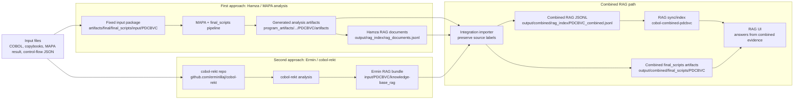
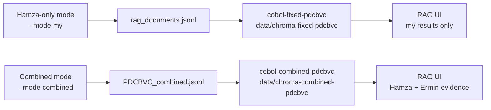

# Combined COBOL RAG Pipeline Diagram

## Independent Test Modes

## Meaning

- First approach, Hamza/MAPA, creates the stable `final_scripts` artifacts and `rag_documents.jsonl`.
- Second approach, Ermin/cobol-rekt, creates the exported `knowledge-base_rag` bundle.
- Combined mode does not overwrite either source. It imports both, labels their provenance, creates integration artifacts, then indexes `PDCBVC_combined.jsonl`.
- Hamza-only and combined tests use separate inbox files, Chroma directories, and collections.
