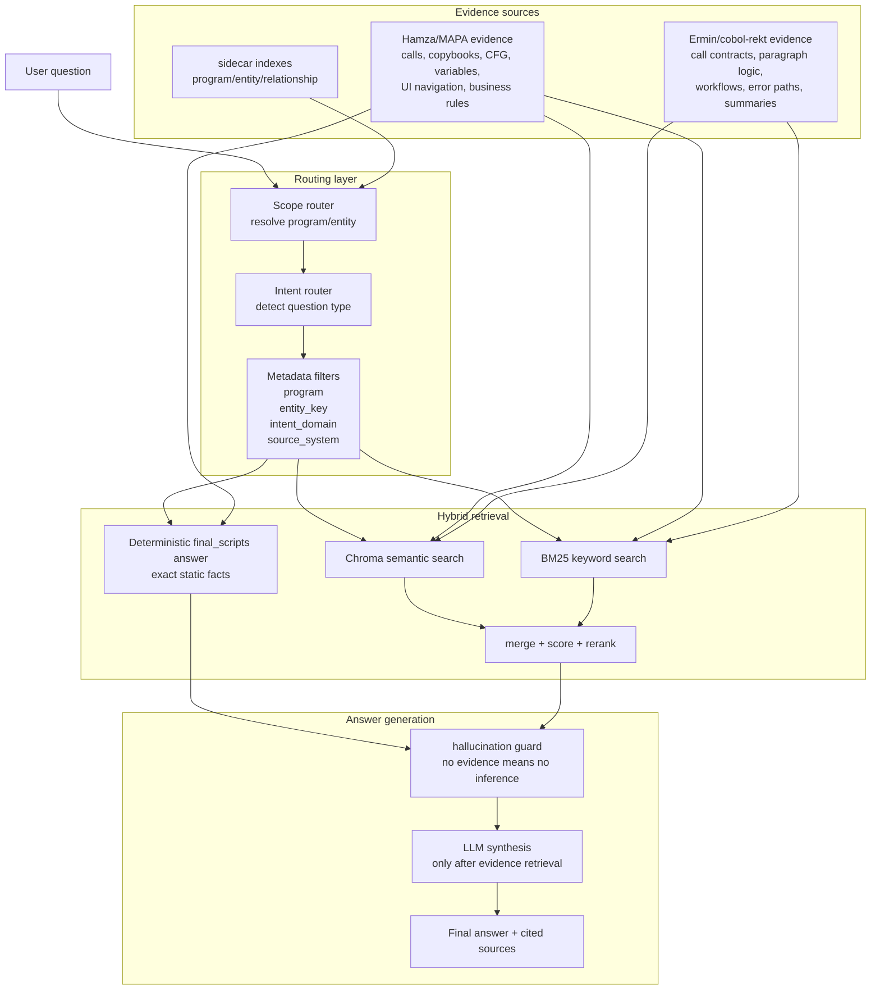

# Current COBOL RAG Architecture

This diagram represents the current organized pipeline after the latest changes.

## Build And Indexing Flow

```mermaid
flowchart LR
  subgraph input["Root input folder"]
    pdc["input/PDCBVC"]
    cbl["PDCBVC.CBL"]
    mapa["PDCBVC_result.txt"]
    cfg["PDCBVC_controlflow.json"]
    copybooks["copybooks/"]
    rekt["knowledge-base_rag/<br/>optional combined mode"]
    pdc --> cbl
    pdc --> mapa
    pdc --> cfg
    pdc --> copybooks
    pdc --> rekt
  end

  subgraph analysis["Analysis repo: control_flow"]
    runner["run_fixed_input.py"]
    packages["work/program_packages"]
    builders["final_scripts builders"]
    artifacts["output/program_artifacts/<br/>programs/PDCBVC/artifacts"]
    maps["global RAG maps<br/>program_index<br/>entity_index<br/>relationship_index"]
    hamza_jsonl["Hamza RAG JSONL<br/>rag_documents.jsonl"]
    combined_import["cobol-rekt importer"]
    combined_artifacts["combined final_scripts<br/>output/combined/final_scripts/PDCBVC"]
    combined_jsonl["Combined RAG JSONL<br/>PDCBVC_combined.jsonl"]
  end

  subgraph metadata["Metadata added to every RAG record"]
    entity_key["entity_key"]
    intent_domain["intent_domain"]
    hierarchy["hierarchy_level"]
    parent["parent_id / parent_type"]
    evidence_path["evidence_path"]
  end

  subgraph ragui["RAG/UI repo: cobol-rag-pipeline"]
    loader["rag_documents loader<br/>preserves metadata"]
    sync["sync/index"]
    chroma["Chroma vector store"]
    bm25["BM25 lexical index"]
    collection_my["cobol-fixed-pdcbvc"]
    collection_combined["cobol-combined-pdcbvc"]
  end

  cbl --> runner
  mapa --> runner
  cfg --> runner
  copybooks --> runner
  runner --> packages
  packages --> builders
  builders --> artifacts
  artifacts --> maps
  artifacts --> hamza_jsonl
  maps --> hamza_jsonl
  hamza_jsonl --> metadata

  rekt --> combined_import
  artifacts --> combined_import
  hamza_jsonl --> combined_import
  combined_import --> combined_artifacts
  combined_import --> combined_jsonl
  combined_jsonl --> metadata

  hamza_jsonl --> loader
  combined_jsonl --> loader
  loader --> sync
  sync --> chroma
  sync --> bm25
  chroma --> collection_my
  chroma --> collection_combined
```



## Query-Time Answer Flow



## Key Idea

The current system is not a simple vector search over random chunks. It is a metadata-aware hybrid RAG:

```text
question
  -> resolve program/entity scope
  -> detect intent
  -> apply metadata filters
  -> retrieve with Chroma + BM25
  -> prefer deterministic final_scripts answers for exact facts
  -> use LLM only to synthesize from retrieved evidence
  -> return answer with sources
```

